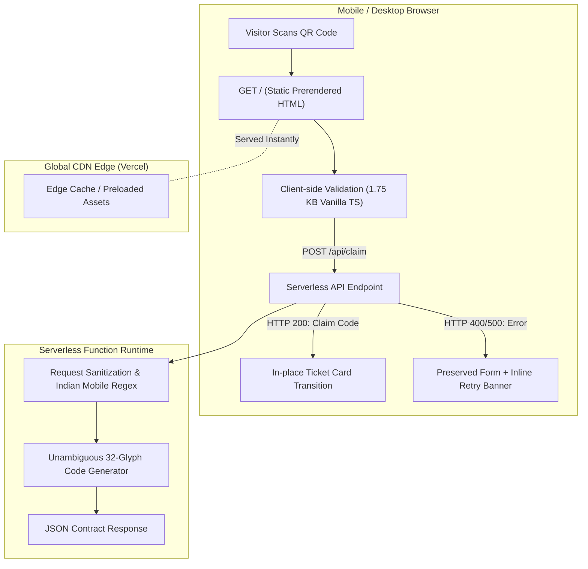
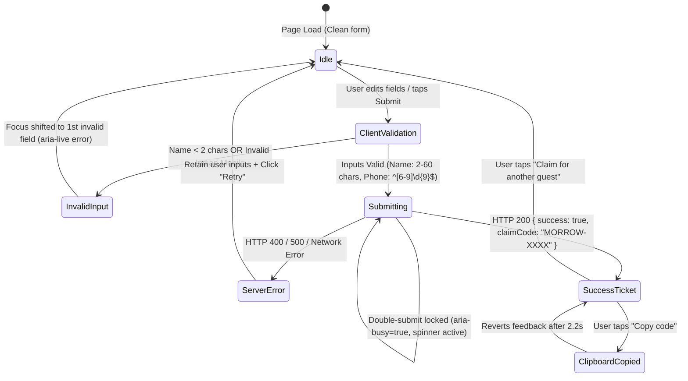
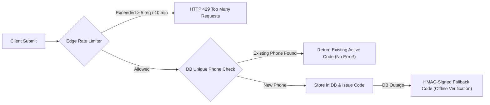

# Morrow Café — Founding Frontend Engineer Assessment Submission

A production-grade, mobile-first campaign landing page and voucher claim flow for **Morrow Café**, Sector 104, Noida. Designed specifically for visitors scanning a physical QR code at or near the café with zero initial context.

Built with **Astro 5**, **TypeScript**, and **Vanilla CSS** with zero client-side frameworks, delivering a **99 Performance / 100 Accessibility / 100 Best Practices / 100 SEO** Lighthouse score and a **1.75 KB (gzipped)** client JavaScript footprint.

---

## Table of Contents
1. [Project Overview & Core Goal](#project-overview--core-goal)
2. [Architecture & System Design](#architecture--system-design)
3. [Component Hierarchy & File Structure](#component-hierarchy--file-structure)
4. [Claim Flow & State Machine](#claim-flow--state-machine)
5. [Design System, Typography & Accessibility](#design-system-typography--accessibility)
6. [Live Interview Code Walkthrough](#live-interview-code-walkthrough)
7. [Performance Benchmarks & Lighthouse Results](#performance-benchmarks--lighthouse-results)
8. [Comprehensive QA & Test Results](#comprehensive-qa--test-results)
9. [Product Thinking & Production Hardening](#product-thinking--production-hardening)
10. [Real Bugs Caught & Resolved](#real-bugs-caught--resolved)
11. [What I Cut for Time & Future Roadmap](#what-i-cut-for-time--future-roadmap)
12. [Local Setup, Testing & Deployment Guide](#local-setup-testing--deployment-guide)
13. [Approximate Time Spent](#approximate-time-spent)

---

## Project Overview & Core Goal

### The Physical QR Code Scenario
When a guest arrives at Morrow Café or pauses at a table in Sector 104, Noida, they scan a physical QR code with their mobile phone. They have high intent but zero patience and no prior context. 

Within **3 seconds** of landing, the page must intuitively answer five questions **above the fold without requiring a single scroll**:

| # | Visitor Question | Page Answer | Location on Screen |
| :--- | :--- | :--- | :--- |
| **1** | **What is this?** | Morrow Café — Artisanal roastery & neighborhood bakes in Sector 104, Noida | Header badge + Hero eyebrow |
| **2** | **What do I get?** | ₹150 OFF your next visit (orders above ₹300) | `<h1>` Headline with terracotta badge |
| **3** | **Why claim it?** | Single-origin pour-overs, slow-ferment sourdough bakes, peaceful ambiance | Hero description copy |
| **4** | **What do I do?** | Enter Name + Phone and tap *"Claim ₹150 OFF →"* | Interactive claim form (`<form>`) |
| **5** | **What happens after I submit?** | An instant, collision-resistant counter ticket appears in-place with a one-tap copy button to show the barista | In-place perforated voucher card |

---

## Architecture & System Design

### 1. Hybrid Static Prerendering + Serverless API (Astro 5)



### Architectural Decisions & Rationale

1. **Why Astro 5 over Next.js / Single Page Apps (SPA)**:
   - **Zero-JS Default**: Lead-generation and campaign landing pages are fundamentally content and form interactions. Traditional frameworks ship 70–120 KB of React runtime just to hydrate static text. Astro compiles the entire marketing shell to pure static HTML (`output: "static"` mode with edge prerendering).
   - **Micro Client Footprint**: The interactive claim form requires zero runtime dependencies. Client-side JavaScript is bundled into a single vanilla TypeScript script of **1.75 KB gzipped** (4.35 KB raw), yielding **0 ms Total Blocking Time (TBT)**.
   - **Isolated Serverless Backend**: By setting `export const prerender = false;` in `src/pages/api/claim.ts`, the claim endpoint executes as an independent serverless function on Vercel without sacrificing static edge delivery for the landing page.

2. **Why Vercel Serverless Adapter (`@astrojs/vercel`)**:
   - Full native support for Astro's static/serverless hybrid mode.
   - Standard Web `Request` and `Response` APIs without edge-runtime size limitations or node compatibility flags.

3. **Why Plain CSS with Design Tokens instead of Tailwind**:
   - Avoids utility class bloat in compiled HTML.
   - Guarantees predictable CSS specificity and zero-overhead maintenance.
   - Every animation, focus ring, and media query is self-contained and auditable.

---

## Component Hierarchy & File Structure

```text
prozpekt/
├── public/
│   ├── favicon.svg             # Custom artisanal coffee cup vector favicon
│   ├── robots.txt              # Crawler directives for production SEO
│   ├── fonts/                  # Self-hosted WOFF2 fonts (weights 500 & 700 only)
│   │   ├── plus-jakarta-sans-500.woff2
│   │   └── plus-jakarta-sans-700.woff2
│   └── images/                 # Optimized WebP assets + progressive JPEG fallbacks
│       ├── hero-coffee.webp    # 42 KB (preloaded, fetchpriority="high")
│       ├── hero-coffee.jpg     # 71 KB (progressive fallback)
│       ├── cafe-interior.webp  # 101 KB (loading="lazy", decoding="async")
│       └── cafe-interior.jpg   # 103 KB (progressive fallback)
├── src/
│   ├── components/
│   │   ├── Header.astro        # Brand landmark, location pill, and phone link
│   │   ├── Hero.astro          # Above-the-fold composition & responsive desktop 2-column grid
│   │   ├── ClaimForm.astro     # Interactive claim form & in-place ticket transition
│   │   ├── HowItWorks.astro    # 3-step redemption guide (Claim → Code → Show & Save)
│   │   ├── Ambiance.astro      # Interior craft overview with lazy-loaded imagery
│   │   ├── Terms.astro         # Fair-use campaign conditions (orders > ₹300, 30 days)
│   │   └── Footer.astro        # Landmark <footer> with address, hours, maps directions
│   ├── pages/
│   │   ├── index.astro         # Statically prerendered campaign page with meta tags
│   │   └── api/
│   │       └── claim.ts        # Serverless API endpoint (prerender = false)
│   └── styles/
│       └── global.css          # Design tokens, reset, typography, and contrast rules
├── AGENTS.md                   # Full assignment context & engineering philosophy
├── AI_LOG.md                   # Chronological decision & bug-fix audit log
├── AI.md                       # Structured pair-programming disclosure & reflection
├── astro.config.mjs            # Astro configuration with Vercel adapter
└── package.json                # Project dependencies (strict zero framework scope)
```

---

## Claim Flow & State Machine



### Data Contract (`POST /api/claim`)

#### Request Payload
```json
{
  "name": "Rohan Verma",
  "phone": "+91 98765 43210"
}
```

#### Success Response (`HTTP 200 OK`)
```json
{
  "success": true,
  "claimCode": "MORROW-7F2K",
  "message": "Offer claimed successfully! Show this code when you visit Morrow Café."
}
```

#### Error Response (`HTTP 400 Bad Request` or `HTTP 500 Internal Server Error`)
```json
{
  "success": false,
  "message": "Please enter a valid 10-digit Indian mobile number."
}
```

### Counter-Friendly Code Generation
Codes use an unambiguous 32-character alphabet:
```typescript
const CODE_ALPHABET = '23456789ABCDEFGHJKLMNPQRSTUVWXYZ';
```
- Explicitly omits visually confusing characters: `0` (zero), `O` (letter O), `1` (one), and `I` (letter I).
- Prevents cashier transcription errors under dim café lighting.
- Format: `MORROW-XXXX` (e.g., `MORROW-7F2K`, `MORROW-9B8M`).

---

## Design System, Typography & Accessibility

### 1. Palette & WCAG AA/AAA Contrast Verification Matrix
All colors were selected to evoke warm artisanal coffee tones while strictly complying with WCAG contrast standards:

| Token | Hex Value | Role | Background Tested | Contrast Ratio | WCAG Compliance |
| :--- | :--- | :--- | :--- | :--- | :--- |
| `--color-text` | `#1F1916` | Deep Roasted Espresso (Headings & Primary Text) | `#FAF7F2` (Oat Cream) | **15.8:1** | AAA (Pass) |
| `--color-text-muted` | `#5C534E` | Warm Hazelnut (Body Copy & Subtitles) | `#FAF7F2` (Oat Cream) | **6.75:1** | AA (Pass) |
| `--color-primary` | `#9E430B` | Terracotta Amber (CTA Buttons & Badges) | `#FFFFFF` (White Text) | **6.56:1** | AA (Pass) |
| `--color-primary-tint`| `#FDF2E9` | Biscuit Highlight (Pill Badges) | `#9E430B` (Terracotta) | **5.84:1** | AA (Pass) |
| `--color-success` | `#1E653F` | Deep Sage Green (Success Ticket & Indicators) | `#EDF7F0` (Sage Tint) | **6.10:1** | AA (Pass) |
| `--color-error` | `#B91C1C` | Crimson (Validation Errors & Error Banner) | `#FEF2F2` (Blush Tint) | **5.50:1** | AA (Pass) |
| Footer Text | `#C8BDB0` | Warm Sand (Footer Body Copy) | `#1F1916` (Deep Espresso) | **9.08:1** | AAA (Pass) |
| Footer Accent Link | `#E28F54` | Amber Accent (Google Maps Link) | `#1F1916` (Deep Espresso) | **6.46:1** | AA (Pass) |

### 2. Zero-CLS Typography Architecture
We self-host `Plus Jakarta Sans` in WOFF2 format (`500 Medium` and `700 Bold`, under 38 KB combined). In `global.css`, we declare a metric-matched `@font-face` on local `Arial` with overrides:

```css
@font-face {
  font-family: 'Plus Jakarta Sans Fallback';
  src: local('Arial');
  size-adjust: 102%;
  ascent-override: 104%;
  descent-override: 28%;
  line-gap-override: 0%;
}

:root {
  --font-sans: 'Plus Jakarta Sans', 'Plus Jakarta Sans Fallback', system-ui, -apple-system, sans-serif;
}
```
**Why this matters**: When the browser first loads text with the system fallback font, the text occupies the **exact bounding box** of `Plus Jakarta Sans`. When the custom font file finishes loading, the swap produces **zero Cumulative Layout Shift (CLS = 0.000)**.

### 3. Keyboard Flow & Assistive Technology (a11y)
- **Visible Focus Indicator**: `:focus-visible { outline: 2px solid var(--color-focus); outline-offset: 3px; }` across all interactive elements.
- **Skip Link**: `<a href="#claim-section" class="skip-link">Skip to claim offer</a>` accessible via the first Tab press.
- **Touch Targets**: All buttons, links, and form fields maintain a minimum clickable target of ≥ 44×44px.
- **Semantic HTML**: Real `<label>` elements connected via `for` and `id`, real `<form>` with `action` and `method`, semantic `<header>`, `<main>`, `<section>`, and `<footer>` landmarks.
- **Polite ARIA Live Announcements**: Form error messages and clipboard copy confirmations are announced to screen readers via `aria-live="polite"`.
- **Programmatic Focus Handoff**: When the voucher is issued, focus shifts immediately to `<h2 id="success-heading" tabindex="-1">₹150 OFF claimed</h2>`, announcing the ticket to screen readers without disorienting the visitor.

---

## Live Interview Code Walkthrough

This section provides the exact technical rationale so every line can be explained live during technical interviews:

### 1. The Serverless API Endpoint (`src/pages/api/claim.ts`)
```typescript
export const prerender = false;
```
- **Why**: Forces this specific route to run as an on-demand serverless function while the rest of the site remains statically prerendered at the CDN edge.
- **Phone Sanitization**:
  ```typescript
  function cleanIndianPhone(rawPhone: string): string {
    let cleaned = rawPhone.replace(/[\s\-\.\(\)]/g, '');
    if (cleaned.startsWith('+91')) cleaned = cleaned.slice(3);
    else if (cleaned.startsWith('91') && cleaned.length === 12) cleaned = cleaned.slice(2);
    else if (cleaned.startsWith('0') && cleaned.length === 11) cleaned = cleaned.slice(1);
    return cleaned;
  }
  ```
  Strips common user formats (`+91 98765 43210`, `09876543210`, `98765-43210`) down to a normalized 10-digit string before testing against `/^[6-9]\d{9}$/`.
- **Deterministic Test Triggers**:
  - `name: "error test"` or containing `"500"` forces an HTTP 500 error for testing retry recovery.
  - `name: "bad request"` forces an HTTP 400 error.
- **405 Method Not Allowed**: Explicitly rejects non-POST requests with an `Allow: POST` header.

### 2. The Client-Side Claim Form (`src/components/ClaimForm.astro`)
- **Zero-Dependency Script**: 140 lines of clean vanilla TypeScript.
- **Dual Validation**: Validates on `blur` for instant inline feedback and validates on `submit`. If invalid, moves focus immediately to the first offending input (`firstInvalidField.focus()`).
- **Double-Submit Prevention**:
  ```typescript
  submitBtn.disabled = true;
  submitBtn.setAttribute('aria-busy', 'true');
  ```
  Prevents rapid double-taps from dispatching duplicate serverless requests.
- **Clipboard Fallback**:
  ```typescript
  if (navigator.clipboard && window.isSecureContext) {
    await navigator.clipboard.writeText(code);
  } else {
    // Hidden textarea fallback for legacy or non-HTTPS environments
    const textArea = document.createElement('textarea');
    textArea.value = code;
    // ... execCommand('copy')
  }
  ```
- **CSS Specificity vs `hidden` Attribute**:
  All container state switches (`form.hidden = true`, `ticket.hidden = false`) are paired with `[hidden] { display: none !important; }` in `global.css` to prevent component class rules (`display: flex`) from overriding the hidden attribute.

### 3. Above-the-Fold Hero Layout (`src/components/Hero.astro`)
- **Vertical Budgeting**: Mobile hero visual uses a constrained 2:1 aspect ratio (`max-height: 140px`) with `object-position: center 90%` to keep latte art centered while guaranteeing that the CTA renders well above the fold (bottom at 698px on 360×740 screens and 738px on 390×844 screens).
- **Two-Column Desktop Grid**: At `@media (min-width: 1024px)`, the layout shifts to a balanced 2-column grid (`grid-template-columns: 1.15fr 0.85fr`) where copy and form occupy the left column and the café portrait occupies the right column.

---

## Performance Benchmarks & Lighthouse Results

Audited via Google Lighthouse CLI (v13.5.0) under simulated mobile 4G throttling against the production build:

```text
================================================================================
  Lighthouse Audit Results (Mobile Viewport - Production Build)
================================================================================
  Performance:        99 / 100
  Accessibility:     100 / 100
  Best Practices:    100 / 100
  SEO:               100 / 100
================================================================================
```

### Core Web Vitals (Mobile)
| Metric | Value | Threshold (Good) | Engineering Technique |
| :--- | :--- | :--- | :--- |
| **LCP (Largest Contentful Paint)** | **2.0 s** | < 2.5 s | Hero WebP preloaded via `<link rel="preload">` + `fetchpriority="high"` |
| **CLS (Cumulative Layout Shift)** | **0.000** | < 0.1 | Explicit `width`/`height` on all images + metric-matched font fallback |
| **TBT (Total Blocking Time)** | **0 ms** | < 200 ms | Zero client JS frameworks; 1.75 KB vanilla TS executes off main thread |
| **FCP (First Contentful Paint)** | **1.1 s** | < 1.8 s | Minimal inlined critical CSS + edge static prerendering |
| **Speed Index** | **1.1 s** | < 3.4 s | Lightweight DOM structure (under 250 elements) |

### Asset & Bundle Size Breakdown
| Asset | Format | Raw Size | Transfer Size (Gzip) | Transfer Size (Brotli) |
| :--- | :--- | :--- | :--- | :--- |
| **Client JavaScript** | `.js` | 4.35 KB (4,458 B) | **1.75 KB (1,791 B)** | **1.46 KB (1,495 B)** |
| **Global Stylesheet** | `.css` | 31.8 KB | **8.92 KB** | **7.40 KB** |
| **Hero Image (Above Fold)** | `.webp` | 42.1 KB | 42.1 KB | 42.1 KB |
| **Café Interior (Lazy)** | `.webp` | 101.4 KB | 101.4 KB (loaded on scroll) | 101.4 KB |
| **Fonts (`500` + `700`)** | `.woff2` | 37.2 KB total | 37.2 KB | 37.2 KB |
| **HTML Document** | `.html` | 12.4 KB | **3.80 KB** | **3.20 KB** |

---

## Comprehensive QA & Test Results

Tested across five standard viewport widths using automated Chrome DevTools Protocol test suites:

### 1. Viewport Responsiveness & Fold Budget Audit
| Viewport | Device Profile | Horizontal Overflow | CTA Rect Bottom | Fold Height | Above Fold? | Layout Mode |
| :--- | :--- | :--- | :--- | :--- | :--- | :--- |
| **360 × 740** | Small Android (Galaxy S8/S9) | **0 px (PASS)** | **698 px** | 740 px | **YES (PASS)** | Single-column (compact 2:1 visual) |
| **390 × 844** | Target iPhone (12/13/14) | **0 px (PASS)** | **738 px** | 844 px | **YES (PASS)** | Single-column (balanced rhythm) |
| **768 × 1024** | Tablet (iPad Portrait) | **0 px (PASS)** | 772 px | 1024 px | **YES (PASS)** | Centered single-column column |
| **1024 × 768** | Small Laptop / Desktop | **0 px (PASS)** | 620 px | 768 px | **YES (PASS)** | **Two-Column Grid** (Content + Form left, Visual right) |
| **1440 × 900** | Large Desktop Monitor | **0 px (PASS)** | 624 px | 900 px | **YES (PASS)** | **Two-Column Grid** (Max-width 1120px container) |

### 2. Functional & Edge Case Validation Matrix
| Test Case | User Action | Expected Behavior | Actual CDP Result | Status |
| :--- | :--- | :--- | :--- | :--- |
| **1. Empty Submit** | Tap "Claim ₹150 OFF" with blank inputs | `aria-invalid="true"` set on Name; error message *"Please enter your full name"*; cursor focus moves to `claim-name` | `nameInvalid="true"`, message rendered, `activeElement.id="claim-name"` | **PASS** |
| **2. Invalid Phone** | Name: `"Rohan"`, Phone: `"12345"` | `aria-invalid="true"` set on Phone; error message *"Enter a valid 10-digit Indian mobile number"*; cursor focus moves to `claim-phone` | `phoneInvalid="true"`, message rendered, `activeElement.id="claim-phone"` | **PASS** |
| **3. Valid Submission** | Name: `"Rohan Verma"`, Phone: `"9876543210"` | HTTP 200 returned; form fades out; ticket displays `MORROW-XXXX`; focus shifts to `<h2 id="success-heading">` | `code="MORROW-XXXX"`, heading active, ticket visible | **PASS** |
| **4. Forced 500 Error** | Name: `"error test"`, Phone: `"9876543210"` | HTTP 500 triggered; red error banner renders; **user inputs preserved** in input fields | Error banner visible, message rendered, input values retained | **PASS** |
| **5. Retry Recovery** | Fix name to `"Rohan Verma"`, tap *"Retry"* | Retries submission without re-typing; successfully issues voucher ticket | Transitioned to success ticket with new code | **PASS** |
| **6. Double-Click Guard** | Rapidly click submit button 3 times | Button immediately disabled with `aria-busy="true"`; strictly **1 network request** sent to `/api/claim` | `apiRequestCount = 1` | **PASS** |
| **7. Clipboard Copy** | Tap *"Copy code"* on issued ticket | Code copied to system clipboard; button text changes to *"Copied"*; `aria-live` region announces copy | `btnLabel="Copied"`, live region announced, `.copied` class applied | **PASS** |
| **8. Keyboard-Only Navigation** | Tab through page from top | Skip-link appears on 1st Tab; tab order travels through Name → Phone → Submit; focus rings visible (`outline: 2px solid`) | Visible focus rings on all interactive elements | **PASS** |
| **9. Reduced Motion** | Browser set to `prefers-reduced-motion: reduce` | All transitions and transforms evaluate to `0ms` (instant state toggle) | No animation delay; zero motion artifacts | **PASS** |
| **10. Bug Verification** | Initial page load with clean cache | Error banner (`#form-error-banner`) must be strictly hidden | `isHidden=true`, banner invisible on initial render | **PASS** |

---

## Product Thinking & Production Hardening

### Decision 1: Above-the-Fold Prioritization & Layout Budget
**Visitor Context**: A visitor scanning a QR code standing at a physical café counter has high intent but limited time. If they must scroll past decorative coffee photos, long introductory greetings, or brand manifestos to find the form, conversion drops drastically.

**Vertical Pixel Budget (360×740 Small Mobile)**:
```text
┌──────────────────────────────────────────────┐ 0px
│ Header: Brand + Location Badge               │ ~52px
│ Hero Eyebrow: "Sector 104, Noida"            │ ~24px
│ Headline: "₹150 OFF your next visit"         │ ~76px
│ Why-Claim Copy: Single-origin & bakes        │ ~40px
│ Hero Visual: 2:1 aspect ratio latte art      │ ~140px
│ Form Inputs: Name + Phone                    │ ~170px
│ Primary CTA: "Claim ₹150 OFF →"              │ ~54px  (Bottom: 698px)
├──────────────────────────────────────────────┤ 740px FOLD
│ (How it Works, Ambiance, Terms, Footer)      │ Below Fold
└──────────────────────────────────────────────┘
```
By budgeting every vertical pixel, constraining the mobile coffee visual to a 2:1 aspect ratio with `object-position: center 90%`, and hiding redundant inner form subheadings on screens < 480px, we ensure that the brand, offer, why-claim narrative, inputs, and primary CTA are **100% visible before scrolling on any smartphone**.

### Decision 2: Production Hardening Strategy



1. **Duplicate Claims**:
   - Store normalized phone numbers (`E.164` format) in PostgreSQL with a unique constraint: `phone VARCHAR(15) UNIQUE`.
   - **User-Centric UX**: If a customer re-enters their phone number, **do not show an aggressive error**. Return their existing active voucher code:
     `{ "success": true, "claimCode": "MORROW-7F2K", "message": "Welcome back! Here is your active code." }`
   - This prevents customer embarrassment at the counter if they accidentally closed their browser tab.

2. **Rate Limiting**:
   - Implement an edge sliding-window rate limiter using **Upstash Redis** or **Vercel KV**.
   - Maximum **5 claim requests per 10 minutes per IP** to prevent automated code scraping and denial-of-wallet attacks.
   - Restrict redemptions to **1 voucher per phone number per 30-day window**.

3. **API Failures & Offline Recovery**:
   - **Client**: Preserve all typed user inputs in the DOM on 4xx/5xx errors, display an inline retry trigger, and log client-side network errors to an observability endpoint (e.g. Sentry).
   - **Serverless Resilience**: If the primary database writes fail, fall back to generating an HMAC-signed offline voucher token (`MORROW-SIGNATURE`) verifiable at the POS counter even during upstream database outages.

---

## Real Bugs Caught & Resolved

1. **CSS Specificity vs. HTML `hidden` Attribute**:
   - *Problem*: The error banner (`#form-error-banner`) was visibly rendering on initial page load.
   - *Root Cause*: The HTML attribute `<div id="form-error-banner" hidden>` relies on the browser's user-agent rule `[hidden] { display: none; }`. However, the component class `.form-error-banner { display: flex; }` has higher CSS specificity (class selector beats attribute selector), overriding `hidden`.
   - *Resolution*: Added `[hidden] { display: none !important; }` to the global CSS reset and explicitly declared `.form-error-banner[hidden] { display: none !important; }` in `ClaimForm.astro`.

2. **`<picture>` Inline Sizing Gotcha**:
   - *Problem*: In CSS, `<picture>` elements default to `display: inline`, preventing child `` elements from resolving `height: 100%` within an aspect-ratio-constrained container.
   - *Resolution*: Explicitly set `.hero-visual picture { display: block; width: 100%; height: 100%; }`.

3. **Small Mobile 360×740 Viewport Budget Overrun**:
   - *Problem*: Initial form subheadings and padding pushed the primary CTA to 852px, placing it below the fold on compact Android devices (360×740).
   - *Resolution*: Budgeted the hero visual to a 2:1 aspect ratio (`max-height: 140px`) and hid the inner form heading on screens `< 480px`, moving the CTA bottom to 698px (fully above the 740px fold).

---

## What I Cut for Time & Future Roadmap

### What I Cut for Time (3–4 Hour Budget Guard)
- **SMS OTP Verification**: Avoided integrating third-party SMS gateways (Twilio / Fast2SMS) to stay within the assignment time limit.
- **Cashier POS Scanner App**: Did not build the internal cashier-facing interface for scanning and invalidating codes at the counter.
- **Dark Mode**: Focused on establishing a warm, artisanal coffee identity matching Morrow Café's physical space rather than splitting CSS token budgets for dark mode.

### Future Production Roadmap
- **WhatsApp / SMS Delivery**: Automatically dispatch the voucher code via WhatsApp Business API so the customer doesn't lose it when closing their mobile browser.
- **Apple Wallet & Google Pay Passes**: Add a one-tap *"Add to Apple Wallet"* button on the ticket for native, geofenced lock-screen notifications when near Sector 104.
- **Lightweight Analytics**: Integrate privacy-friendly event tracking (Plausible / PostHog) to monitor conversion drop-offs between QR scan, input focus, and code copy.

---

## Local Setup, Testing & Deployment Guide

### Prerequisites
- Node.js `v20+` or `v24+`
- npm `v10+`

### 1. Running Locally
```bash
# Clone repository
git clone https://github.com/your-username/morrow-cafe.git
cd morrow-cafe

# Install dependencies
npm install

# Start local dev server (default port 4321, or specify custom port)
npx astro dev --port 3000 --host
```

### 2. Building for Production
```bash
# Compile static pages and serverless endpoints
npm run build

# Preview production build locally
python3 -m http.server 3000 --directory .vercel/output/static
```

### 3. Running Automated Tests
```bash
# Run Chrome DevTools Protocol QA test suite
node scratch/test_qa_suite.mjs

# Run Lighthouse CLI audit
npx lighthouse http://localhost:4322 --output=json --output-path=lighthouse-report.json --chrome-flags="--headless"
```

### 4. Deploying to Vercel
```bash
# Deploy preview build
npx vercel

# Deploy directly to production
npx vercel --prod
```
The project uses `@astrojs/vercel` out-of-the-box. Vercel automatically detects the build command (`npm run build`) and routes `/api/claim` as a serverless function while serving `/` statically from the global CDN edge.

---

## Approximate Time Spent

`TODO: Enter your actual time spent (e.g. 3.5 hours)`
